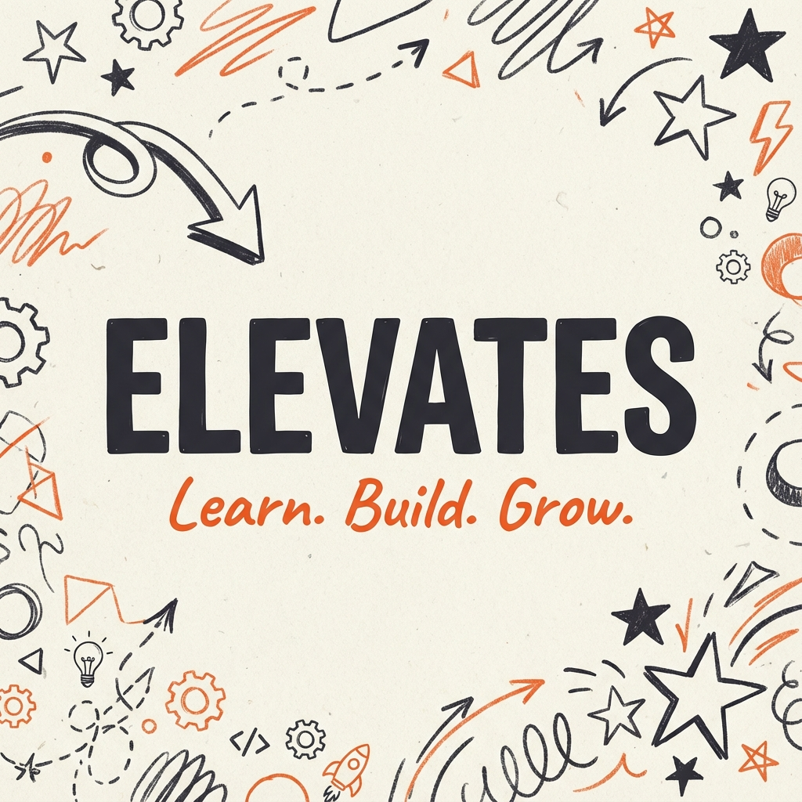

# 🚀 ELEVATES — Web Application

<div align="center">



### **Upskilling & Showcasing Skilled but Shy Students**
*From quiet talent to real impact.*

[](https://www.elevates.live/)
[](https://nextjs.org/)
[](https://www.typescriptlang.org/)
[](https://tailwindcss.com/)
[](https://greensock.com/gsap/)

---

[Website](https://www.elevates.live/) • [Instagram](https://www.instagram.com/elevates.club/) • [LinkedIn](https://www.linkedin.com/company/elevates-in) • [GitHub](https://github.com/Elevates-Foundation)

</div>

---

## 📖 About ELEVATES

**ELEVATES** is a student-driven community built to find skilled but shy or introverted students, upskill them through real projects and support, and showcase their work so quiet talent no longer stays invisible.

Guided by the principle **LEARN. BUILD. GROW.**, ELEVATES bridges academic theory and industry practice through hands-on workshops, hackathons, and collaborative open-source products.

---

## ✨ Features & Architecture

- 🎨 **Neo-Brutalist Notebook Aesthetic**: Paper textures, torn collage edges, tape strips, and hand-drawn doodles.
- 📜 **Horizontal Pinned Scroll**: Pinned 5-panel interactive journey powered by **GSAP ScrollTrigger**.
- 🕹️ **Draggable Kinetic Stickers**: Physics-based interactive floating elements built with **GSAP Draggable**.
- 🎫 **Concert-Ticket Lineup**: Retro ticket booth displaying completed and upcoming workshops with QR codes.
- 🔍 **SEO, AIO & GEO Optimized**: 
  - Dynamic `sitemap.xml` & `robots.txt` generation.
  - Enriched `Organization` & `EducationalOrganization` **JSON-LD Schema**.
  - Structured plain-text entity definitions for AI search engines (**ChatGPT, Perplexity, Gemini, Claude, Google AI Overviews**).
- ⚡ **Ultra-Smooth Inertial Scroll**: **Lenis** smooth scrolling integration.

---

## 🛠️ Tech Stack

| Domain | Technology |
|---|---|
| **Framework** | Next.js 16 (App Router, React 19) |
| **Language** | TypeScript |
| **Styling** | Tailwind CSS v4 + Vanilla CSS Design Tokens |
| **Animations** | GSAP (`ScrollTrigger`, `Draggable`, `quickTo`) |
| **Smooth Scroll** | `@studio-freight/lenis` |
| **Typography** | Google Fonts (`Inter`, `Kalam`, `VT323`) |

---

## 🚀 Getting Started

### Prerequisites

- Node.js `18.x` or higher
- npm / yarn / pnpm

### Installation

1. **Clone the Repository**
   ```bash
   git clone https://github.com/Elevates-Foundation/Elevates-web.git
   cd Elevates-web
   ```

2. **Install Dependencies**
   ```bash
   npm install
   ```

3. **Run Development Server**
   ```bash
   npm run dev
   ```
   Open [http://localhost:3000](http://localhost:3000) in your browser.

4. **Build for Production**
   ```bash
   npm run build
   npm run start
   ```

---

## 📂 Project Structure

```text
elevates-web/
├── public/                  # Favicons, WebManifest, OG Images, SVGs
├── src/
│   ├── app/
│   │   ├── favicon.ico
│   │   ├── globals.css      # Core Design Tokens & Animations
│   │   ├── layout.tsx       # Root Layout, Metadata & JSON-LD Schema
│   │   ├── not-found.tsx    # Custom 404 Page
│   │   ├── opengraph-image.tsx
│   │   ├── page.tsx         # Main Landing Page Composition
│   │   ├── robots.ts        # Dynamic robots.txt Generator
│   │   └── sitemap.ts       # Dynamic sitemap.xml Generator
│   ├── components/
│   │   ├── about.tsx        # Horizontal Scroll About Panels
│   │   ├── custom-cursor.tsx# Physics Mouse Tracking Cursor
│   │   ├── domains.tsx      # Multi-Disciplinary Domain Accordion
│   │   ├── doodle.tsx       # Hand-Drawn SVG Doodles
│   │   ├── features.tsx     # Animated Marquee Banner
│   │   ├── footer.tsx       # Semantic Footer with Social Links
│   │   ├── future-scope.tsx # Expansion Roadmap
│   │   ├── hero.tsx         # Interactive Draggable Hero Banner
│   │   ├── loader.tsx       # Preloader Sequence
│   │   ├── membership.tsx   # Benefits & Selection Criteria
│   │   ├── navbar.tsx       # Sticky Navigation Bar
│   │   ├── programs.tsx     # Concert Ticket Workshop Lineup
│   │   ├── smooth-scroll.tsx# Lenis Inertial Scroll Wrapper
│   │   └── workflow.tsx     # 5-Step Student Journey
│   └── hooks/
│       └── use-isomorphic-layout-effect.ts
├── package.json
└── README.md
```

---

## 🌐 Official Channels

- 🌐 **Website**: [www.elevates.live](https://www.elevates.live/)
- 📸 **Instagram**: [@elevates.club](https://www.instagram.com/elevates.club/)
- 💼 **LinkedIn**: [ELEVATES](https://www.linkedin.com/company/elevates-in)
- 🐙 **GitHub**: [Elevates-Foundation](https://github.com/Elevates-Foundation)

---

## 📄 License

Distributed under the MIT License. See `LICENSE` for details.

---

<div align="center">
  <sub>Built with chaos & precision by the <strong>ELEVATES Community</strong>.</sub>
</div>
