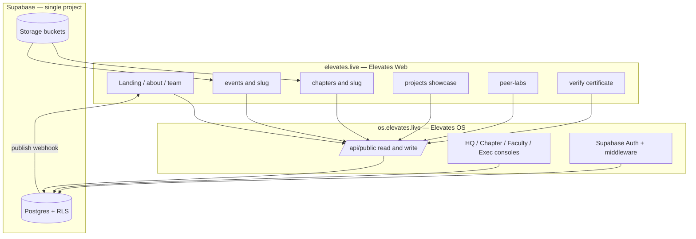

Elevates OS ↔ Elevates Web — Architecture Review & Connection Plan
<aside>
⚡

**Verdict:** The two repos are architecturally compatible (same Next.js 16 / React 19 / TS / Tailwind 4 base), but they are **not** ready to connect yet. Three blockers: (1) `Elevates-web` has no backend layer at all on `main` — no Supabase dependency, data is static TypeScript files; (2) the OS Postgres schema is **behind** the OS TypeScript types — the flagship Forms engine has no tables; (3) the OS RLS policies are read-everything-if-logged-in, which leaks every student's data across every chapter. Fix those three, then connect via one shared Supabase project with OS as the only write plane.

</aside>

---

## 1. What is actually in each repo (verified against `main`)

### Elevates OS — `Elevates-Foundation/Elevates-os`

| Aspect | Reality on `main` |
| --- | --- |
| Created / activity | 19 Jul 2026, 31 commits, single contributor (SQADIRKVM) |
| Framework | Next.js **16.2.10**, React **19.2.4**, TS 5, Tailwind 4, Node ≥20 |
| Backend deps | `@supabase/supabase-js` 2.110, `@supabase/ssr` 0.12 |
| Domain deps | TipTap 3 (full editor), `qrcode`  • `react-qr-code`, `recharts`, `docx`, `zod`, `react-hook-form`, `date-fns` |
| Route groups | `src/app/(app)/hq/*`, `(app)/chapter/[slug]/*`, `(app)/executive`, `(app)/faculty`, `(app)/eos`, `(app)/design-system` |
| Data runtime | **Demo store is the default.** `src/lib/mode.ts` returns demo unless `NEXT_PUBLIC_USE_DEMO_STORE=false`. State lives in React context + `sessionStorage` |
| DB | `supabase/migrations/001_elevates_os_core.sql` — 24 tables, RLS enabled on all |

**Tables that exist in SQL today:** `organizations`, `chapters`, `profiles`, `roles`, `permissions`, `role_permissions`, `user_roles`, `leadership_terms`, `leadership_assignments`, `clusters`, `cluster_members`, `events`, `event_form_fields`, `event_registrations`, `attendance`, `certificates`, `projects`, `project_members`, `resources`, `tasks`, `reports`, `announcements`, `notifications`, `activity_logs`.

### Elevates Web — `Elevates-Foundation/Elevates-web`

| Aspect | Reality on `main` |
| --- | --- |
| Created / activity | 10 Aug 2026, 83 commits, same single contributor |
| Framework | Next.js **16.0.7**, React **19.2.0**, TS 5, Tailwind 4 + Sass |
| Backend deps | **None.** No Supabase, no DB client, no auth library |
| Experience deps | GSAP 3.13, Lenis, `three` 0.181, `@react-three/fiber`  • `drei`, Rive |
| Shipped routes | `/`, `about`, `chapters`, `clusters`, `code-of-conduct`, `events`, `for-colleges`, `elevates-for-colleges-pdf`, `peer-labs`, `pitch-2026`, `privacy`, `projects`, `team`, `robots.ts`, `sitemap.ts`, `opengraph-image.tsx`, `llms.txt`, `llms-full.txt` |
| Source layout | `src/app`, `src/components`, `src/data`, `src/hooks`, `src/types`, `src/middleware.ts` |
| Content | `content/blog/*.mdx`, heavy image set committed to git (several 1–4 MB JPEG/HEIC files) |

### Where your write-up differs from the code

<aside>
⚠️

These three deltas matter, because a plan built on the doc instead of the code will break.

</aside>

1. **The web "protected dashboard" tree does not exist.** Your Elevates Web doc lists `(app)/hq`, `(app)/chapter`, `(app)/faculty`, `(app)/executive`, `leaderboards`, `notifications`, `workflows`, `f/`, `verify/`, `lib/supabase`, `lib/permissions`, `lib/attendance`, and `supabase/`. None of those are on `main`. Web is currently a **pure public site backed by `src/data/*.ts`**. That is good news — see §2.
2. **The Forms engine has no database.** `spec.md` domain 4 is "replace Google Forms", and the types define `forms` + `formResponses`, but `001_elevates_os_core.sql` only has `event_form_fields` bolted onto events. There is no `forms`, `form_responses`, `departments`, `class_cohorts`, `cluster_invites`, `guidelines`, `resource_categories`, or `outbound_messages` table.
3. **Naming drift between types and SQL.** Types say `registrations`; SQL says `event_registrations`. `events` has no `slug` and no publish flag, so the public site literally cannot address an event by URL yet.

---

## 2. The single decision that drives everything else

Both repos are currently on a path to implement the *same* admin surfaces. Kill that now and lock the boundary:

| Concern | Elevates Web (elevates.live) | Elevates OS (os.elevates.live) |
| --- | --- | --- |
| Audience | Public, unauthenticated, SEO/AIO | Logged-in members, 16 roles |
| Rendering | SSG/ISR, marketing motion (GSAP/three) | Dynamic, client-heavy ERP shell |
| Reads | Public projections only | All data, RLS-scoped |
| Writes | **Only** RSVP, form submit, join, college lead — proxied to OS | Everything |
| Auth | Anonymous. "Sign in" is a link to OS | Owns Supabase Auth + middleware |
| Never touches | Service role key, `profiles`, roles, reports, tasks | Marketing copy, blog MDX, pitch decks |

<aside>
🚫

**Do not build `/hq`, `/chapter`, `/faculty`, `/executive`, `/leaderboards`, `/workflows` in Elevates Web.** They already exist in OS. Duplicating them creates two RBAC implementations against one database — the fastest way to a permissions bug that exposes student data.

</aside>

One exception worth keeping on Web: **`/verify/certificate/[id]`**. It is a public, link-shared, SEO-valuable URL that students paste into resumes. Keep it on the `elevates.live` domain, but have it fetch from the OS API. Decide this **before** issuing any production certificate, because the URL gets burned into the QR code permanently.

---

## 3. Target architecture



**Deployment layout**

| Host | App | Env keys |
| --- | --- | --- |
| `elevates.live` | Elevates Web | `OS_API_URL`, `OS_API_TOKEN`, `REVALIDATE_SECRET` |
| `os.elevates.live` | Elevates OS | Supabase URL, anon key, **service role key**, `WEB_REVALIDATE_URL` |
| Supabase | one project, two environments (staging + prod) | — |

Same apex domain for both is deliberate: it makes cookie-based SSO trivial later and keeps certificate/QR URLs on the brand domain.

---

## 4. How the two actually talk

### Option comparison

| Option | How | Verdict |
| --- | --- | --- |
| **A.** Web queries Supabase directly with anon key | Add `@supabase/supabase-js` to Web, rely on RLS `public` policies | ❌ Couples the marketing site to the DB schema, duplicates RLS reasoning, every schema rename breaks the site |
| **B.** Web calls a versioned `/api/public/*` on OS ✅ | OS owns queries, shapes, validation, rate limits | ✅ **Recommended.** One write plane, one place to reason about exposure, Web stays dumb and fast |
| **C.** Merge into a Turborepo monorepo | `apps/web`, `apps/os`, `packages/contracts`, `packages/db` | ⏳ Do this later — it is the right end state, but it is a migration, not a connection |

Go with **B now**, keep **C** as the Q2 refactor. B does not block C.

### The contract surface

All under `os.elevates.live/api/public/v1`. Reads are cacheable and unauthenticated; writes require a shared token + rate limit + captcha.

| Method | Endpoint | Replaces in Web | Notes |
| --- | --- | --- | --- |
| GET | `/chapters` | `src/data/chapters/index.ts` | Only `status=active`  • `published` |
| GET | `/chapters/[slug]` | `src/data/chapters/*.ts` | Roster comes from `leadership_assignments`, not hardcoded |
| GET | `/events?status=upcoming\ | past&chapter=` | `src/data/events.ts` |
| GET | `/events/[slug]` | — | Includes seats left, registration window |
| GET | `/projects` · `/projects/[slug]` | `src/data/projects.ts` | Only `is_showcased` |
| GET | `/peer-labs` · `/peer-labs/[slug]` | `src/data/peer-labs.ts` | Needs new tables (§5) |
| GET | `/team` | `src/data/team/*` | From `profiles`  • `leadership_assignments` |
| GET | `/stats` | hardcoded counters in `hero.tsx` | Live chapter/event/student counts |
| GET | `/verify/certificate/[id]` | — | Via RPC, never a table select |
| POST | `/events/[slug]/register` | — | Creates `event_registrations` with `status='pending'` → OS approval queue |
| POST | `/forms/[formId]/submit` | — | Public form fill |
| POST | `/leads/college` | `/for-colleges` form | New `college_leads` table |
| POST | `/join` | `/join` | Creates lead, not a profile |

### Shape of a read (Web side)

```tsx
// src/lib/os-client.ts  (new file in Elevates-web)
const BASE = process.env.OS_API_URL! // https://os.elevates.live/api/public/v1

export async function osGet<T>(path: string, tags: string[]): Promise<T> {
  const res = await fetch(`${BASE}${path}`, {
    headers: { "x-elevates-client": "web" },
    next: { revalidate: 300, tags },
  })
  if (!res.ok) throw new Error(`OS ${path} → ${res.status}`)
  return res.json() as Promise<T>
}

// usage in a server component
const events = await osGet<PublicEvent[]>("/events?status=upcoming", ["events"])
```

<aside>
🛟

**Keep `src/data/*.ts` as the fallback.** Wrap every fetch so that a non-2xx from OS falls back to the current static data instead of throwing. That means the marketing site can never be taken down by a backend deploy — the same "demo mode" philosophy OS already uses in `mode.ts`.

</aside>

### Shape of a write (RSVP)

```tsx
// OS: src/app/api/public/v1/events/[slug]/register/route.ts
export async function POST(req: Request, { params }) {
  const body = registerSchema.parse(await req.json())      // zod, already a dep
  assertClientToken(req)                                    // shared secret
  await rateLimit(req, `register:${params.slug}`, 5, "10m")
  const admin = createServiceClient()                       // service role, OS only
  // capacity check → insert pending registration → mint QR → queue email
}
```

RSVPs land as **pending**, which drops them straight into the existing chapter approve → QR check-in → certificate loop. No new workflow needed on the OS side.

---

## 5. Schema work required before connecting

```sql
-- 004_public_surface.sql

-- 1. Addressable + publishable events
alter table events add column slug text;
alter table events add column published_at timestamptz;
alter table events add column summary text;
alter table events add column banner_url text;
alter table events add column mode text check (mode in ('in_person','online','hybrid'));
create unique index events_chapter_slug_idx on events (chapter_id, slug);

-- 2. Public projection flags
alter table chapters add column published boolean not null default false;
alter table chapters add column logo_url text;
alter table chapters add column district text;
alter table projects add column slug text;
alter table projects add column is_showcased boolean not null default false;
alter table profiles add column is_public boolean not null default false;

-- 3. The missing Forms engine (spec domain 4)
create table forms (
  id uuid primary key default gen_random_uuid(),
  chapter_id uuid references chapters(id) on delete cascade,
  event_id uuid references events(id) on delete set null,
  slug text not null unique,
  title text not null,
  description text,
  schema jsonb not null default '[]'::jsonb,   -- questions + logic
  status text not null default 'draft' check (status in ('draft','open','closed')),
  is_public boolean not null default false,
  created_by uuid references profiles(id),
  created_at timestamptz not null default now()
);
create table form_responses (
  id uuid primary key default gen_random_uuid(),
  form_id uuid not null references forms(id) on delete cascade,
  respondent_id uuid references profiles(id),
  answers jsonb not null default '{}'::jsonb,
  submitted_at timestamptz not null default now()
);

-- 4. Web-only entities that have no home yet
create table peer_labs (
  id uuid primary key default gen_random_uuid(),
  slug text not null unique, title text not null, track text,
  syllabus jsonb not null default '[]'::jsonb,
  status text not null default 'upcoming',
  applications_open boolean not null default false
);
create table college_leads (
  id uuid primary key default gen_random_uuid(),
  college text not null, contact_name text not null,
  email text not null, phone text, role text, message text,
  status text not null default 'new',
  source text not null default 'web',
  created_at timestamptz not null default now()
);

-- 5. Certificate verification without exposing the table
create or replace function verify_certificate(cert_id text)
returns table (certificate_id text, holder text, event_title text, issued_at timestamptz)
language sql security definer stable as $$
  select c.certificate_id, p.full_name, e.title, c.issued_at
  from certificates c
  join profiles p on p.id = c.user_id
  join events e on e.id = c.event_id
  where c.certificate_id = cert_id
$$;
```

Also resolve the `registrations` vs `event_registrations` naming split in one direction and update `src/types/index.ts` + `supabase-bootstrap.ts` to match.

---

## 6. Security fixes — blocking, do these first

<aside>
🔴

The current policies in `001_elevates_os_core.sql` are placeholders ("tighten per-role in later migrations"). They must not reach production, and definitely must not be reachable from a public website.

</aside>

| # | Issue | Impact | Fix |
| --- | --- | --- | --- |
| 1 | `create policy "authenticated read profiles" ... using (true)` | **Any** logged-in student reads every student's email, phone-adjacent fields, resume URL, across all chapters | Scope to own row + same-chapter execs via a `user_roles` lookup |
| 2 | Same `using (true)` on `event_registrations`, `attendance`, `reports`, `tasks`, `activity_logs` | Cross-tenant leakage — kills the multi-tenant promise | Chapter-scoped predicate helper `is_chapter_member(chapter_id)` |
| 3 | `create policy "public verify certificates" on certificates for select to anon using (true)` | Anonymous internet can dump the entire certificates table | Revoke; expose only the `verify_certificate()` RPC above |
| 4 | Service role key would be needed in Web for direct writes | One leaked env var = full DB compromise | Never put it in Web. Writes go through OS API only |
| 5 | Public RSVP endpoint | Spam / seat squatting | Shared client token + IP rate limit + Turnstile on the Web form |
| 6 | `002_rls_write_policies.sql` unreviewed | Unknown | Audit it before flipping `USE_DEMO_STORE=false` |

---

## 7. Publish + cache invalidation

The public site should be static-fast but not stale. Tag-based ISR both ways:

1. Web fetches with `next: { tags: ['events'] }` etc. (see §4).
2. When an exec publishes an event in OS, OS fires a webhook: `POST https://elevates.live/api/revalidate` with `{ tags: ['events','chapter:ekc'], secret }`.
3. Web's route handler calls `revalidateTag()` for each tag.
4. Fallback: 5-minute `revalidate` so a missed webhook self-heals.

Same trick for chapters, projects, peer-labs, and the `/stats` counters.

---

## 8. Auth (phase 2, not needed for launch)

The public site does not need login. When you want "my tickets" on `elevates.live`:

- Keep Supabase Auth **only** in OS. Set the auth cookie on `.elevates.live` (leading dot) via `@supabase/ssr` cookie options.
- Web's "Sign in" is a link to `os.elevates.live/login?next=...`.
- Web reads the session cookie read-only to personalise (name, "you're registered"), and never writes.
- Roles stay entirely in OS — Web never evaluates a permission.

---

## 9. Phased rollout

### Phase 0 — Foundation (week 1)

- [ ]  Freeze the boundary in §2 as a written rule in both READMEs
- [ ]  Align versions: bump Web to Next 16.2.10 / React 19.2.4, add `engines.node >= 20`
- [ ]  Create Supabase **staging** project, apply `001` + `002` + `003`
- [ ]  Audit and rewrite RLS per §6 as `005_rls_tenant_scope.sql`
- [ ]  Decide the canonical certificate verify URL (recommend `elevates.live/verify/certificate/[id]`)

### Phase 1 — Make OS real (weeks 2–3)

- [ ]  Apply `004_public_surface.sql` (slugs, publish flags, forms, peer_labs, college_leads, RPC)
- [ ]  Sync `src/types/index.ts` with SQL; fix `registrations` naming
- [ ]  Extend `supabase-bootstrap.ts` to hydrate the new tables
- [ ]  Move Forms mutations out of `store-context.tsx` into Supabase-backed server actions
- [ ]  Run OS with `NEXT_PUBLIC_USE_DEMO_STORE=false` + `NEXT_PUBLIC_USE_SUPABASE_AUTH=true` on staging; `/api/health` must report `mode: "supabase"`
- [ ]  Migrate Web's `src/data/*.ts` content into Supabase as the seed for real records

### Phase 2 — Ship the contract (week 4)

- [ ]  Build `/api/public/v1/*` read endpoints in OS (§4 table)
- [ ]  Add zod response schemas + a versioned `openapi.json`
- [ ]  Publish shared types: `packages/contracts` as a git submodule or a private npm package consumed by both repos
- [ ]  Add `src/lib/os-client.ts` to Web with static-data fallback
- [ ]  Add `/api/revalidate` to Web + publish webhook in OS

### Phase 3 — Cut over the public site (week 5)

- [ ]  Switch `/chapters`, `/events`, `/projects`, `/team`, `/peer-labs`, `/stats` to live data behind a `USE_LIVE_DATA` flag
- [ ]  Make `sitemap.ts` generate from live slugs
- [ ]  Move committed images to Supabase Storage; add `remotePatterns` and `next/image` (this alone will fix the 1–4 MB assets currently in git)
- [ ]  Add `/verify/certificate/[id]` on Web backed by the RPC

### Phase 4 — Write path (week 6)

- [ ]  `POST /events/[slug]/register` + Turnstile + rate limit → pending registration
- [ ]  `POST /forms/[formId]/submit` → `form_responses`
- [ ]  `POST /leads/college` → `college_leads`, surfaced in an HQ inbox
- [ ]  Transactional email (Resend) on approve + certificate issue
- [ ]  End-to-end test: RSVP on elevates.live → approve in OS → QR scan → certificate → verify link resolves

### Phase 5 — Consolidation (later)

- [ ]  Turborepo monorepo: `apps/web`, `apps/os`, `packages/contracts`, `packages/db`, `packages/brand`
- [ ]  Shared brand tokens package (`#f26430`, logo, fonts) — keep the two *visual* systems separate on purpose

---

## 10. Version & config drift to fix

| Item | OS | Web | Action |
| --- | --- | --- | --- |
| Next.js | 16.2.10 | 16.0.7 | Align on 16.2.10 |
| React | 19.2.4 | 19.2.0 | Align |
| `eslint-config-next` | 16.2.10 | 16.0.7 | Align |
| Node engines | `>=20` | unset | Add to Web |
| Styling | Tailwind 4 | Tailwind 4 + Sass | Fine — drop Sass if unused |
| Design language | Finexy-light ERP | Neo-brutalist notebook | **Keep both.** Only share brand tokens |

---

## 11. Open decisions I need from you

1. **Domains** — is it `os.elevates.live` for OS, or `elevates.live/app`? This changes the cookie and CORS setup.
2. **Certificate URL** — brand domain (`elevates.live/verify/...`) or OS domain? Irreversible once QRs are printed.
3. **Peer Labs ownership** — do cohorts get managed inside OS (new domain), or stay marketing-only content for now?
4. **Monorepo timing** — connect the two repos as-is (faster), or merge first and connect inside one repo (cleaner, ~1 week extra)?
5. **Who deploys** — one Vercel team with two projects, or separate hosting?z

<aside>
⚡

**Verdict:** The two repos are architecturally compatible (same Next.js 16 / React 19 / TS / Tailwind 4 base), but they are **not** ready to connect yet. Three blockers: (1) `Elevates-web` has no backend layer at all on `main` — no Supabase dependency, data is static TypeScript files; (2) the OS Postgres schema is **behind** the OS TypeScript types — the flagship Forms engine has no tables; (3) the OS RLS policies are read-everything-if-logged-in, which leaks every student's data across every chapter. Fix those three, then connect via one shared Supabase project with OS as the only write plane.

</aside>

---

## 1. What is actually in each repo (verified against `main`)

### Elevates OS — `Elevates-Foundation/Elevates-os`

| Aspect | Reality on `main` |
| --- | --- |
| Created / activity | 19 Jul 2026, 31 commits, single contributor (SQADIRKVM) |
| Framework | Next.js **16.2.10**, React **19.2.4**, TS 5, Tailwind 4, Node ≥20 |
| Backend deps | `@supabase/supabase-js` 2.110, `@supabase/ssr` 0.12 |
| Domain deps | TipTap 3 (full editor), `qrcode`  • `react-qr-code`, `recharts`, `docx`, `zod`, `react-hook-form`, `date-fns` |
| Route groups | `src/app/(app)/hq/*`, `(app)/chapter/[slug]/*`, `(app)/executive`, `(app)/faculty`, `(app)/eos`, `(app)/design-system` |
| Data runtime | **Demo store is the default.** `src/lib/mode.ts` returns demo unless `NEXT_PUBLIC_USE_DEMO_STORE=false`. State lives in React context + `sessionStorage` |
| DB | `supabase/migrations/001_elevates_os_core.sql` — 24 tables, RLS enabled on all |

**Tables that exist in SQL today:** `organizations`, `chapters`, `profiles`, `roles`, `permissions`, `role_permissions`, `user_roles`, `leadership_terms`, `leadership_assignments`, `clusters`, `cluster_members`, `events`, `event_form_fields`, `event_registrations`, `attendance`, `certificates`, `projects`, `project_members`, `resources`, `tasks`, `reports`, `announcements`, `notifications`, `activity_logs`.

### Elevates Web — `Elevates-Foundation/Elevates-web`

| Aspect | Reality on `main` |
| --- | --- |
| Created / activity | 10 Aug 2026, 83 commits, same single contributor |
| Framework | Next.js **16.0.7**, React **19.2.0**, TS 5, Tailwind 4 + Sass |
| Backend deps | **None.** No Supabase, no DB client, no auth library |
| Experience deps | GSAP 3.13, Lenis, `three` 0.181, `@react-three/fiber`  • `drei`, Rive |
| Shipped routes | `/`, `about`, `chapters`, `clusters`, `code-of-conduct`, `events`, `for-colleges`, `elevates-for-colleges-pdf`, `peer-labs`, `pitch-2026`, `privacy`, `projects`, `team`, `robots.ts`, `sitemap.ts`, `opengraph-image.tsx`, `llms.txt`, `llms-full.txt` |
| Source layout | `src/app`, `src/components`, `src/data`, `src/hooks`, `src/types`, `src/middleware.ts` |
| Content | `content/blog/*.mdx`, heavy image set committed to git (several 1–4 MB JPEG/HEIC files) |

### Where your write-up differs from the code

<aside>
⚠️

These three deltas matter, because a plan built on the doc instead of the code will break.

</aside>

1. **The web "protected dashboard" tree does not exist.** Your Elevates Web doc lists `(app)/hq`, `(app)/chapter`, `(app)/faculty`, `(app)/executive`, `leaderboards`, `notifications`, `workflows`, `f/`, `verify/`, `lib/supabase`, `lib/permissions`, `lib/attendance`, and `supabase/`. None of those are on `main`. Web is currently a **pure public site backed by `src/data/*.ts`**. That is good news — see §2.
2. **The Forms engine has no database.** `spec.md` domain 4 is "replace Google Forms", and the types define `forms` + `formResponses`, but `001_elevates_os_core.sql` only has `event_form_fields` bolted onto events. There is no `forms`, `form_responses`, `departments`, `class_cohorts`, `cluster_invites`, `guidelines`, `resource_categories`, or `outbound_messages` table.
3. **Naming drift between types and SQL.** Types say `registrations`; SQL says `event_registrations`. `events` has no `slug` and no publish flag, so the public site literally cannot address an event by URL yet.

---

## 2. The single decision that drives everything else

Both repos are currently on a path to implement the *same* admin surfaces. Kill that now and lock the boundary:

| Concern | Elevates Web (elevates.live) | Elevates OS (os.elevates.live) |
| --- | --- | --- |
| Audience | Public, unauthenticated, SEO/AIO | Logged-in members, 16 roles |
| Rendering | SSG/ISR, marketing motion (GSAP/three) | Dynamic, client-heavy ERP shell |
| Reads | Public projections only | All data, RLS-scoped |
| Writes | **Only** RSVP, form submit, join, college lead — proxied to OS | Everything |
| Auth | Anonymous. "Sign in" is a link to OS | Owns Supabase Auth + middleware |
| Never touches | Service role key, `profiles`, roles, reports, tasks | Marketing copy, blog MDX, pitch decks |

<aside>
🚫

**Do not build `/hq`, `/chapter`, `/faculty`, `/executive`, `/leaderboards`, `/workflows` in Elevates Web.** They already exist in OS. Duplicating them creates two RBAC implementations against one database — the fastest way to a permissions bug that exposes student data.

</aside>

One exception worth keeping on Web: **`/verify/certificate/[id]`**. It is a public, link-shared, SEO-valuable URL that students paste into resumes. Keep it on the `elevates.live` domain, but have it fetch from the OS API. Decide this **before** issuing any production certificate, because the URL gets burned into the QR code permanently.

---

## 3. Target architecture


**Deployment layout**

| Host | App | Env keys |
| --- | --- | --- |
| `elevates.live` | Elevates Web | `OS_API_URL`, `OS_API_TOKEN`, `REVALIDATE_SECRET` |
| `os.elevates.live` | Elevates OS | Supabase URL, anon key, **service role key**, `WEB_REVALIDATE_URL` |
| Supabase | one project, two environments (staging + prod) | — |

Same apex domain for both is deliberate: it makes cookie-based SSO trivial later and keeps certificate/QR URLs on the brand domain.

---

## 4. How the two actually talk

### Option comparison

| Option | How | Verdict |
| --- | --- | --- |
| **A.** Web queries Supabase directly with anon key | Add `@supabase/supabase-js` to Web, rely on RLS `public` policies | ❌ Couples the marketing site to the DB schema, duplicates RLS reasoning, every schema rename breaks the site |
| **B.** Web calls a versioned `/api/public/*` on OS ✅ | OS owns queries, shapes, validation, rate limits | ✅ **Recommended.** One write plane, one place to reason about exposure, Web stays dumb and fast |
| **C.** Merge into a Turborepo monorepo | `apps/web`, `apps/os`, `packages/contracts`, `packages/db` | ⏳ Do this later — it is the right end state, but it is a migration, not a connection |

Go with **B now**, keep **C** as the Q2 refactor. B does not block C.

### The contract surface

All under `os.elevates.live/api/public/v1`. Reads are cacheable and unauthenticated; writes require a shared token + rate limit + captcha.

| Method | Endpoint | Replaces in Web | Notes |
| --- | --- | --- | --- |
| GET | `/chapters` | `src/data/chapters/index.ts` | Only `status=active`  • `published` |
| GET | `/chapters/[slug]` | `src/data/chapters/*.ts` | Roster comes from `leadership_assignments`, not hardcoded |
| GET | `/events?status=upcoming\ | past&chapter=` | `src/data/events.ts` |
| GET | `/events/[slug]` | — | Includes seats left, registration window |
| GET | `/projects` · `/projects/[slug]` | `src/data/projects.ts` | Only `is_showcased` |
| GET | `/peer-labs` · `/peer-labs/[slug]` | `src/data/peer-labs.ts` | Needs new tables (§5) |
| GET | `/team` | `src/data/team/*` | From `profiles`  • `leadership_assignments` |
| GET | `/stats` | hardcoded counters in `hero.tsx` | Live chapter/event/student counts |
| GET | `/verify/certificate/[id]` | — | Via RPC, never a table select |
| POST | `/events/[slug]/register` | — | Creates `event_registrations` with `status='pending'` → OS approval queue |
| POST | `/forms/[formId]/submit` | — | Public form fill |
| POST | `/leads/college` | `/for-colleges` form | New `college_leads` table |
| POST | `/join` | `/join` | Creates lead, not a profile |

### Shape of a read (Web side)

```tsx
// src/lib/os-client.ts  (new file in Elevates-web)
const BASE = process.env.OS_API_URL! // https://os.elevates.live/api/public/v1

export async function osGet<T>(path: string, tags: string[]): Promise<T> {
  const res = await fetch(`${BASE}${path}`, {
    headers: { "x-elevates-client": "web" },
    next: { revalidate: 300, tags },
  })
  if (!res.ok) throw new Error(`OS ${path} → ${res.status}`)
  return res.json() as Promise<T>
}

// usage in a server component
const events = await osGet<PublicEvent[]>("/events?status=upcoming", ["events"])
```

<aside>
🛟

**Keep `src/data/*.ts` as the fallback.** Wrap every fetch so that a non-2xx from OS falls back to the current static data instead of throwing. That means the marketing site can never be taken down by a backend deploy — the same "demo mode" philosophy OS already uses in `mode.ts`.

</aside>

### Shape of a write (RSVP)

```tsx
// OS: src/app/api/public/v1/events/[slug]/register/route.ts
export async function POST(req: Request, { params }) {
  const body = registerSchema.parse(await req.json())      // zod, already a dep
  assertClientToken(req)                                    // shared secret
  await rateLimit(req, `register:${params.slug}`, 5, "10m")
  const admin = createServiceClient()                       // service role, OS only
  // capacity check → insert pending registration → mint QR → queue email
}
```

RSVPs land as **pending**, which drops them straight into the existing chapter approve → QR check-in → certificate loop. No new workflow needed on the OS side.

---

## 5. Schema work required before connecting

```sql
-- 004_public_surface.sql

-- 1. Addressable + publishable events
alter table events add column slug text;
alter table events add column published_at timestamptz;
alter table events add column summary text;
alter table events add column banner_url text;
alter table events add column mode text check (mode in ('in_person','online','hybrid'));
create unique index events_chapter_slug_idx on events (chapter_id, slug);

-- 2. Public projection flags
alter table chapters add column published boolean not null default false;
alter table chapters add column logo_url text;
alter table chapters add column district text;
alter table projects add column slug text;
alter table projects add column is_showcased boolean not null default false;
alter table profiles add column is_public boolean not null default false;

-- 3. The missing Forms engine (spec domain 4)
create table forms (
  id uuid primary key default gen_random_uuid(),
  chapter_id uuid references chapters(id) on delete cascade,
  event_id uuid references events(id) on delete set null,
  slug text not null unique,
  title text not null,
  description text,
  schema jsonb not null default '[]'::jsonb,   -- questions + logic
  status text not null default 'draft' check (status in ('draft','open','closed')),
  is_public boolean not null default false,
  created_by uuid references profiles(id),
  created_at timestamptz not null default now()
);
create table form_responses (
  id uuid primary key default gen_random_uuid(),
  form_id uuid not null references forms(id) on delete cascade,
  respondent_id uuid references profiles(id),
  answers jsonb not null default '{}'::jsonb,
  submitted_at timestamptz not null default now()
);

-- 4. Web-only entities that have no home yet
create table peer_labs (
  id uuid primary key default gen_random_uuid(),
  slug text not null unique, title text not null, track text,
  syllabus jsonb not null default '[]'::jsonb,
  status text not null default 'upcoming',
  applications_open boolean not null default false
);
create table college_leads (
  id uuid primary key default gen_random_uuid(),
  college text not null, contact_name text not null,
  email text not null, phone text, role text, message text,
  status text not null default 'new',
  source text not null default 'web',
  created_at timestamptz not null default now()
);

-- 5. Certificate verification without exposing the table
create or replace function verify_certificate(cert_id text)
returns table (certificate_id text, holder text, event_title text, issued_at timestamptz)
language sql security definer stable as $$
  select c.certificate_id, p.full_name, e.title, c.issued_at
  from certificates c
  join profiles p on p.id = c.user_id
  join events e on e.id = c.event_id
  where c.certificate_id = cert_id
$$;
```

Also resolve the `registrations` vs `event_registrations` naming split in one direction and update `src/types/index.ts` + `supabase-bootstrap.ts` to match.

---

## 6. Security fixes — blocking, do these first

<aside>
🔴

The current policies in `001_elevates_os_core.sql` are placeholders ("tighten per-role in later migrations"). They must not reach production, and definitely must not be reachable from a public website.

</aside>

| # | Issue | Impact | Fix |
| --- | --- | --- | --- |
| 1 | `create policy "authenticated read profiles" ... using (true)` | **Any** logged-in student reads every student's email, phone-adjacent fields, resume URL, across all chapters | Scope to own row + same-chapter execs via a `user_roles` lookup |
| 2 | Same `using (true)` on `event_registrations`, `attendance`, `reports`, `tasks`, `activity_logs` | Cross-tenant leakage — kills the multi-tenant promise | Chapter-scoped predicate helper `is_chapter_member(chapter_id)` |
| 3 | `create policy "public verify certificates" on certificates for select to anon using (true)` | Anonymous internet can dump the entire certificates table | Revoke; expose only the `verify_certificate()` RPC above |
| 4 | Service role key would be needed in Web for direct writes | One leaked env var = full DB compromise | Never put it in Web. Writes go through OS API only |
| 5 | Public RSVP endpoint | Spam / seat squatting | Shared client token + IP rate limit + Turnstile on the Web form |
| 6 | `002_rls_write_policies.sql` unreviewed | Unknown | Audit it before flipping `USE_DEMO_STORE=false` |

---

## 7. Publish + cache invalidation

The public site should be static-fast but not stale. Tag-based ISR both ways:

1. Web fetches with `next: { tags: ['events'] }` etc. (see §4).
2. When an exec publishes an event in OS, OS fires a webhook: `POST https://elevates.live/api/revalidate` with `{ tags: ['events','chapter:ekc'], secret }`.
3. Web's route handler calls `revalidateTag()` for each tag.
4. Fallback: 5-minute `revalidate` so a missed webhook self-heals.

Same trick for chapters, projects, peer-labs, and the `/stats` counters.

---

## 8. Auth (phase 2, not needed for launch)

The public site does not need login. When you want "my tickets" on `elevates.live`:

- Keep Supabase Auth **only** in OS. Set the auth cookie on `.elevates.live` (leading dot) via `@supabase/ssr` cookie options.
- Web's "Sign in" is a link to `os.elevates.live/login?next=...`.
- Web reads the session cookie read-only to personalise (name, "you're registered"), and never writes.
- Roles stay entirely in OS — Web never evaluates a permission.

---

## 9. Phased rollout

### Phase 0 — Foundation (week 1)

- [ ]  Freeze the boundary in §2 as a written rule in both READMEs
- [ ]  Align versions: bump Web to Next 16.2.10 / React 19.2.4, add `engines.node >= 20`
- [ ]  Create Supabase **staging** project, apply `001` + `002` + `003`
- [ ]  Audit and rewrite RLS per §6 as `005_rls_tenant_scope.sql`
- [ ]  Decide the canonical certificate verify URL (recommend `elevates.live/verify/certificate/[id]`)

### Phase 1 — Make OS real (weeks 2–3)

- [ ]  Apply `004_public_surface.sql` (slugs, publish flags, forms, peer_labs, college_leads, RPC)
- [ ]  Sync `src/types/index.ts` with SQL; fix `registrations` naming
- [ ]  Extend `supabase-bootstrap.ts` to hydrate the new tables
- [ ]  Move Forms mutations out of `store-context.tsx` into Supabase-backed server actions
- [ ]  Run OS with `NEXT_PUBLIC_USE_DEMO_STORE=false` + `NEXT_PUBLIC_USE_SUPABASE_AUTH=true` on staging; `/api/health` must report `mode: "supabase"`
- [ ]  Migrate Web's `src/data/*.ts` content into Supabase as the seed for real records

### Phase 2 — Ship the contract (week 4)

- [ ]  Build `/api/public/v1/*` read endpoints in OS (§4 table)
- [ ]  Add zod response schemas + a versioned `openapi.json`
- [ ]  Publish shared types: `packages/contracts` as a git submodule or a private npm package consumed by both repos
- [ ]  Add `src/lib/os-client.ts` to Web with static-data fallback
- [ ]  Add `/api/revalidate` to Web + publish webhook in OS

### Phase 3 — Cut over the public site (week 5)

- [ ]  Switch `/chapters`, `/events`, `/projects`, `/team`, `/peer-labs`, `/stats` to live data behind a `USE_LIVE_DATA` flag
- [ ]  Make `sitemap.ts` generate from live slugs
- [ ]  Move committed images to Supabase Storage; add `remotePatterns` and `next/image` (this alone will fix the 1–4 MB assets currently in git)
- [ ]  Add `/verify/certificate/[id]` on Web backed by the RPC

### Phase 4 — Write path (week 6)

- [ ]  `POST /events/[slug]/register` + Turnstile + rate limit → pending registration
- [ ]  `POST /forms/[formId]/submit` → `form_responses`
- [ ]  `POST /leads/college` → `college_leads`, surfaced in an HQ inbox
- [ ]  Transactional email (Resend) on approve + certificate issue
- [ ]  End-to-end test: RSVP on elevates.live → approve in OS → QR scan → certificate → verify link resolves

### Phase 5 — Consolidation (later)

- [ ]  Turborepo monorepo: `apps/web`, `apps/os`, `packages/contracts`, `packages/db`, `packages/brand`
- [ ]  Shared brand tokens package (`#f26430`, logo, fonts) — keep the two *visual* systems separate on purpose

---

## 10. Version & config drift to fix

| Item | OS | Web | Action |
| --- | --- | --- | --- |
| Next.js | 16.2.10 | 16.0.7 | Align on 16.2.10 |
| React | 19.2.4 | 19.2.0 | Align |
| `eslint-config-next` | 16.2.10 | 16.0.7 | Align |
| Node engines | `>=20` | unset | Add to Web |
| Styling | Tailwind 4 | Tailwind 4 + Sass | Fine — drop Sass if unused |
| Design language | Finexy-light ERP | Neo-brutalist notebook | **Keep both.** Only share brand tokens |

---

## 11. Open decisions I need from you

1. **Domains** — is it `os.elevates.live` for OS, or `elevates.live/app`? This changes the cookie and CORS setup.
2. **Certificate URL** — brand domain (`elevates.live/verify/...`) or OS domain? Irreversible once QRs are printed.
3. **Peer Labs ownership** — do cohorts get managed inside OS (new domain), or stay marketing-only content for now?
4. **Monorepo timing** — connect the two repos as-is (faster), or merge first and connect inside one repo (cleaner, ~1 week extra)?
5. **Who deploys** — one Vercel team with two projects, or separate hosting?